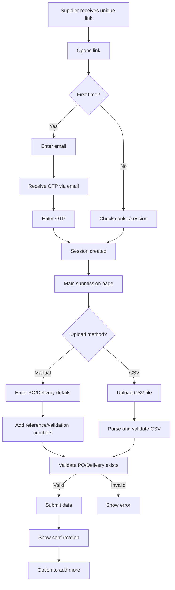
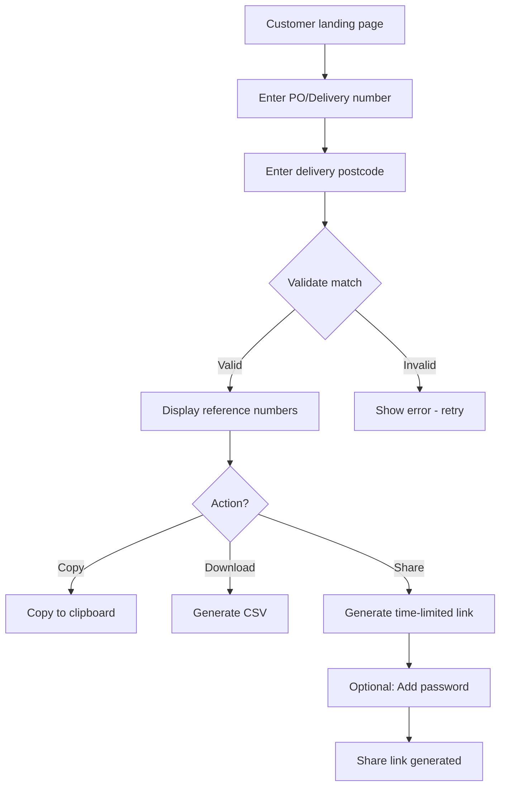
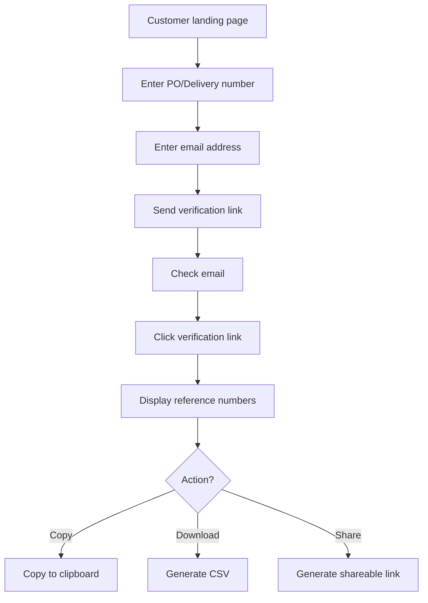

# External Reference Number Portal - Architecture & Flows

## Database Schema

```sql
-- Supplier access tokens
supplier_links (
  id UUID PRIMARY KEY,
  supplier_identifier VARCHAR,
  created_at TIMESTAMP,
  last_used TIMESTAMP,
  is_active BOOLEAN
)

-- Reference number submissions
reference_submissions (
  id UUID PRIMARY KEY,
  supplier_link_id UUID REFERENCES supplier_links,
  po_number VARCHAR,
  delivery_id VARCHAR,
  reference_number VARCHAR,
  validation_number VARCHAR,
  submitted_by_email VARCHAR,
  submitted_at TIMESTAMP,
  updated_at TIMESTAMP
)

-- Customer access logs
customer_access_logs (
  id UUID PRIMARY KEY,
  po_number VARCHAR,
  delivery_id VARCHAR,
  access_method VARCHAR, -- 'postcode', 'email', 'link'
  accessed_by_email VARCHAR,
  accessed_at TIMESTAMP,
  ip_address VARCHAR
)

-- Temporary access tokens
access_tokens (
  token VARCHAR PRIMARY KEY,
  po_number VARCHAR,
  delivery_id VARCHAR,
  expires_at TIMESTAMP,
  max_uses INTEGER,
  uses_count INTEGER DEFAULT 0
)
```

## API Endpoints

### Supplier Endpoints
- `POST /api/supplier/verify-email` - Send OTP
- `POST /api/supplier/validate-otp` - Verify OTP and create session
- `GET /api/supplier/submissions/{supplier_link_id}` - View past submissions
- `POST /api/supplier/submit` - Submit reference numbers
- `POST /api/supplier/bulk-upload` - CSV upload

### Customer Endpoints
- `POST /api/customer/request-access` - Request access (email or postcode)
- `GET /api/customer/references/{po_or_delivery}` - Retrieve reference numbers
- `POST /api/customer/generate-link` - Create shareable link
- `GET /api/customer/download-csv/{po_or_delivery}` - Download as CSV

## Detailed User Flows

### Supplier Flow



### Customer Flow - Postcode Verification



### Customer Flow - Email Verification



## Security Considerations

### For Suppliers
1. **Persistent Unique Links**
   - One link per supplier relationship
   - Can be revoked if compromised
   - Track usage patterns for anomalies

2. **Email Verification**
   - OTP valid for 10 minutes
   - Session valid for 30 days
   - Option to "remember this device"

3. **Validation**
   - PO/Delivery must exist in system
   - Rate limiting on submissions
   - Duplicate detection with alerts

### For Customers
1. **Access Control Options**
   - **Basic**: PO + Postcode (like parcel tracking)
   - **Enhanced**: PO + Email verification
   - **Shareable**: Time-limited tokens with optional password

2. **Data Protection**
   - No sensitive commercial data exposed
   - Access logs for audit trail
   - GDPR compliance for email storage

3. **Rate Limiting**
   - Max 5 attempts per IP per hour
   - Exponential backoff for failures

## UI/UX Considerations

### Supplier Interface
- Clean, single-purpose page
- Clear instructions for first-time users
- Progress indicators for CSV uploads
- Success confirmations with summary
- History view of submissions

### Customer Interface
- Minimal fields, maximum clarity
- Mobile-responsive design
- Quick copy buttons for reference numbers
- Clear download options
- Share functionality with preview

## Implementation Phases

### Phase 1 - MVP
- Basic supplier submission (manual entry only)
- Customer retrieval with postcode verification
- Simple CSV download

### Phase 2 - Enhanced Features
- CSV upload for suppliers
- Email verification option
- Shareable links
- Submission history

### Phase 3 - Advanced Features
- API integration options
- Bulk operations
- Advanced duplicate handling
- Analytics dashboard

## Naming Suggestions
- "Reference Exchange Portal"
- "External Reference Hub"
- "Supplier Connect"
- "Quick Reference Access"